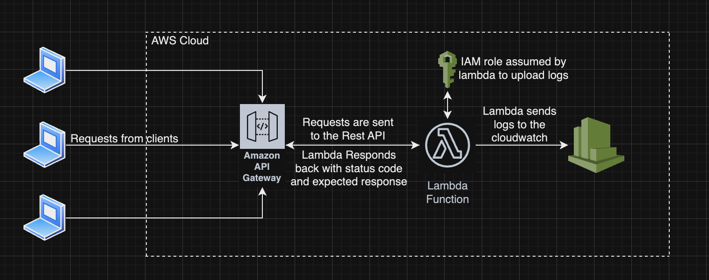

# simpleApi
This repo is for creating a sample express application with 2 endpoints. One is a GET endpoint and another POST.

Below is the architecture diagram of this application:



1. The requests from Client reaches the REST API Gateway. API Gateway has {proxy+} path which accepts any URI. Since we only have one lambda this set up is apt. 
2. The REST Api Calls are then routed to the lambda. 
3. The lambda then processes the req based on the URI and the data sent to it.
4. We have an IAM role created which is assumed by the Lambda to push logs to the cloudwatch log group.

CICD Pipeline:

CICD is achieved via Github Actions. Following steps are performed as part of CICD pipeline.
1. Job get triggered automatically on push to master, we can also trigger the job manually.
2. First step in the actions is to checkout the code, the job runs on a remote server with label ubuntu-latest managed by Github. Since the server does not have the code in it, we have to ensure we checkout the code or in other words we have to clone the repository on the build server. 
3. After checking out the code, we need to install NodeJS inside the server, NodeJS is required for building the app and to install application dependencies. 
4. We have an optional step included which uses caching for node modules. This step ensures we use data from cache which reduces build time. 
5. Install Dependencies - The dependencies defined in package.json needs to be installed on the server before we run deploy, here we run the command ```npm install```.
6. Install Serverless - To deploy the serverless application we need serverless installed on the server.
7. Deploy the serverless template - We use serverless framework to deploy the application. We use the command ```serverless deploy --stage <stage-name> --region <aws-region>``` to deploy the application. 
Here stage-name if required to deploy/release the API gateway. Just creating the gateway does not help, it needs to be staged or deployed. aws-region is required to ensure we deploy the stack in a specific region in AWS.

Instructions to test and verify the application:

API HOST URL: https://r5dtw2rjoj.execute-api.us-east-1.amazonaws.com/dev
There are two endpoints:
1. /login
2. /hello

/login is a POST call, this endpoint needs to be called first to ensure we have JWT token to call the /hello endpoint.
/login endpoint required JSON input. JSON body needs to as shown below:

```{"username":"<name>"}```

This endpoint uses the username provided to generate a signed token, this token is then returned as response.
Example API call:
```curl --header "Content-Type: application/json" --request POST --data '{"username":"<name>"}' https://r5dtw2rjoj.execute-api.us-east-1.amazonaws.com/dev/login```

/hello is a GET endpoint which returns the message ```Hello World!```. This endpoint needs JWT Token for authorization, this token needs to be passed as header. 
Example API call:
```curl --header "Content-Type: application/json" --header "Authorization: Bearer <token>" --request GET https://r5dtw2rjoj.execute-api.us-east-1.amazonaws.com/dev/hello``` 

